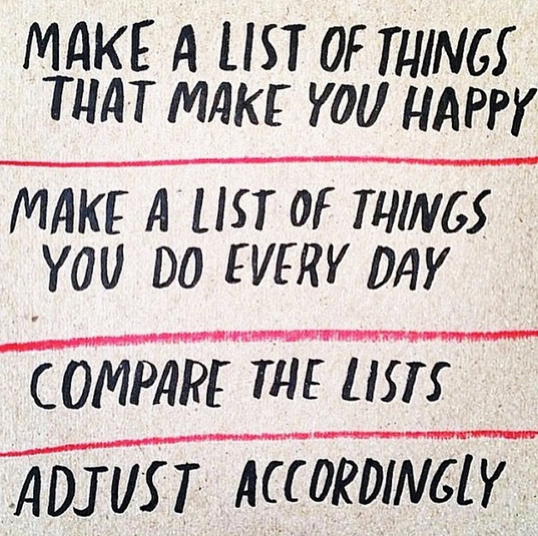

# live-accordingly
Live life on purpose. Live what makes you happy.

## The idea
I have way too many things I'd like to do that make me happy, and in many categories (professional life, personal life, hobbies, side-projects...) A simple web app could help me

- Compare and set relative priorities where it would otherwise be difficult
- Track what I'm doing every day over time
- Compare what I'm doing to what makes me happy
- Suggest how I might adjust accordingly

## More details

### Habit
A habit is something that makes you happy or that you'd like to accomplish. It could be a "todo" item, like "exercise 30 mins" or just generally a part of the life you want to have, like "time in nature".

- `id`
- `category_id`
- `name`
- `description`
- `routine_frequency` how many times a week you want to do this habit

### Category
Aspects may fall into various categories, for instance professional goals vs relationship goals.

A category can have many aspects associated with it, but aspects only have one category. Someone may wish to create duplicates, eg "Be more assertive at work" and "Be more assertive in my personal life".

- `id`
- `name`

### Comparison
Comparing only two goals at a time helps you get clarity on how to prioritize among a large amount of goals. Imagine "hot or not" but with goal names instead of profile pictures. 

*Rough prioritization algorithm*: For every pair of goals in all categories: the user has to pick one goal to "win" over the other. A goal gets one point if it wins, 0 if it loses.

- `id`
- `winning_goal_id`
- `goal_id_1`
- `goal_id_2`

### Checkin
At the end of my day (or throughout the day) I'd do some of the things I said make me happy. When I'm done doing one of those things, I'll check in. The app will remember what I've done, and show me how I'm doing vs what I told it makes me happy.

- `id`
- `aspect_id`
- `time`
- `happiness_score` 1-5, to help train the app - and yourself - whether it *actually* makes you happy

### Daily happiness
The typical subjective happiness test it to ping yourself randomly throughout the day, and ask "how happy are you right now? 1-5". The app can use this to tell things like "you're happiest in the mornings", or "you're happiest on days you wrote in the morning"

- `id`
- `time (datetime)`
- `score`

### Goal
An overall life goal. This is freeform, and you can only have three active at a time. Examples would be "Run a marathon", "establish a healthy nighttime routine". They wouldn't be connected to aspects or routines, but we can check in on them periodically. Happiness = progress toward meaningful goals.

- `id`
- `name`
- `meaning`
- `progress_percent`
- `active` (bool)

## Further reading
- http://www.fastcompany.com/3040387/how-i-get-it-done/how-a-life-audit-helps-you-do-what-you-really-want-to-do
- http://www.fastcompany.com/3044043/most-creative-people/stanfords-most-popular-class-isnt-computer-science-its-something-much-m
- http://designyourlife.com.au/
- https://www.coach.me/
- https://www.happier.com/
- https://www.senseapp.com
